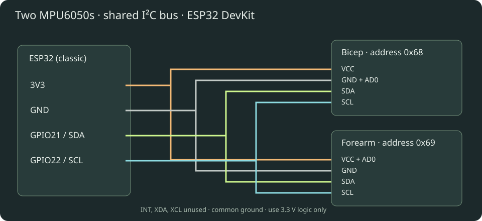

# Armature — two-IMU arm tracker

Three.js viewer + ESP32 firmware, with BLE notifications and stationary pose calibration. Open `dist/index.html` through a local web server (not file://), or use the hosted site. The viewer includes a demo without hardware. Full illustrated setup is in `dist/guide.html`.

## Motion Arcade

The home page now has **Zombie Boxing**, **Target Rush**, and the original **Motion Lab**. Connection and calibration are shared across modes; switching games keeps the BLE connection. Existing firmware/protocol is unchanged.

- Zombie Boxing: enemies approach from ahead; two distinct right-arm punches defeat each one. Five health points, increasing waves, and 100 points per knockout. Enemies in reach attack every 2.3 seconds if not hit.
- Target Rush: hit as many illuminated targets as possible in 45 seconds.
- Live input: choose ESP32, connect and calibrate with the same arm-down pose. Raise your right arm and punch forward toward the screen; pull back at least 9 cm before punching again. Face the same direction used at calibration. The left arm is an animated-model guard, not independently tracked.
- Keyboard / touch: an explicit simulation mode. Press Space or the Punch button. It never injects hits into live-input rounds.
- Escape or Pause freezes a round. Stale/invalid tracking and hidden tabs automatically pause live play; press Resume after recovery. Switching mode or input starts a new round.

Punch detection derives wrist motion from the two tracked segment orientations, uses a swept collision test, and requires outward velocity plus retraction between hits. It is a game heuristic, not a measured punching force. Keep space around you and use controlled movements. Live hardware punch feel still needs testing with the actual wearable.

## Hardware and wiring

Assumption: a classic ESP32 DevKit/WROOM with Bluetooth LE, and two MPU6050 breakout modules (such as GY-521), not bare sensor chips. ESP32-S2 has no Bluetooth. Other ESP32 variants require checking their pinout and changing SDA_PIN/SCL_PIN.

| ESP32 | Bicep MPU6050 | Forearm MPU6050 |
|---|---|---|
| 3V3 | VCC | VCC and AD0 |
| GND | GND and AD0 | GND |
| GPIO21 | SDA | SDA |
| GPIO22 | SCL | SCL |

Bicep address is 0x68; forearm is 0x69. Leave INT, XDA and XCL disconnected. Power off before wiring. Use common ground and 3.3 V pull-ups, never 5 V on ESP32 GPIO. Most breakouts already have pull-ups; check yours before adding any. If absent, add one 4.7 kΩ SDA-to-3V3 and one SCL-to-3V3 resistor. Keep wires short, secured, and separated from high-current wiring. Long arm-length I²C cables can become unreliable at 400 kHz: reduce Wire.begin clock to 100000 if needed and measure the resulting sample rate. USB power from a power bank is convenient for a wearable demo. Insulate the boards.

## Flash

1. Install Arduino IDE 2. Add `https://espressif.github.io/arduino-esp32/package_esp32_index.json` under Preferences → Additional Boards Manager URLs.
2. In Boards Manager install **esp32 by Espressif Systems**, version 3.x. Select **ESP32 Dev Module** for a classic ESP32; select the actual serial port.
3. Library Manager: install **NimBLE-Arduino by h2zero, version 2.3.6**. Wire is built in; no MPU library is needed. Firmware uses the NimBLE 2.x callbacks.
4. Open `firmware/ArmTracker/ArmTracker.ino`, upload, and open Serial Monitor at 115200 baud. If upload stalls, hold BOOT during connection and release once writing begins.
5. Expect `MPU 0x68: OK`, `MPU 0x69: OK`, and `Ready`. A missing sensor halts startup; fix wiring and reset. An MPU at 0x69 still normally reports WHO_AM_I 0x68.

## Sensor mounting and calibration — mandatory convention

Use the **right arm**. Secure one sensor to the bicep and one to the forearm so neither slips relative to that segment. In the reference pose, both boards must have **+X toward the wrist/down, +Y forward, +Z to your right**. Use the sensor's actual axis marks/datasheet, not the breakout's connector edge. This means the boards lie against the outer side of the arm. Axis alignment matters: a one-pose gravity calibration cannot recover arbitrary mounting heading.

Stand upright, right arm straight down at your side, palm toward thigh. Connect, click **Calibrate pose**, and stay still for three seconds. Firmware checks acceleration magnitude, the expected gravity direction (approximately -1g on sensor X), gyro magnitude and variance for both sensors. Movement restarts the sample window; after 12 seconds the attempt fails. Rejected calibration requires another button press. If it repeatedly fails, check mounting axes, raw sensor behavior and motion. A constant slow rotation can evade stationary detection; actually hold still.

Successful calibration stores gyro biases in RAM and resets both sensor-to-world quaternions to a shared reference. Moving the sensors, resetting the ESP32, significant temperature changes, or heading drift requires recalibration. Bias is not saved to flash. Wait for temperature to settle for best performance.

## Browser and Bluetooth

1. Use Chrome on macOS, Windows, or a supported Android device, with Bluetooth enabled. Safari/Firefox and Chrome on iPhone/iPad do not provide this native Web Bluetooth flow. Linux support may require experimental features and an appropriate BlueZ setup; a supported desktop is easier.
2. Serve locally: `python3 -m http.server 5173 --bind 127.0.0.1 --directory dist`, then open `http://localhost:5173` in Chrome. Node users can also run `npm start` if Python is installed. HTTPS hosting also works. Plain HTTP LAN IP addresses and file:// are not suitable. Open as a top-level page; embedded previews may block Bluetooth through Permissions Policy. The browser device picker requires a user click.
3. Click **Connect ESP32**, select **Armature-ESP32**, and approve the browser's device access. Do not pair through a Bluetooth Classic serial terminal: this uses BLE GATT. No PIN, serial COM Bluetooth port, Wi-Fi or backend is required.
4. Calibrate, then move. Enter measured shoulder-to-elbow and elbow-to-wrist distances in cm. Drag to orbit; scroll to zoom.
5. To reconnect, use Connect again. Close other BLE clients if the board is unavailable; reset the board if necessary. After changing firmware services, remove the old site's Bluetooth permission or restart Bluetooth if the OS retains a stale GATT cache.

The app distinguishes demo, live, calibration and stale states. A packet gap of over 500 ms marks the display stale and freezes the last received pose. Last packet age is browser receive freshness, **not measured sensor-to-screen latency**. BLE access is local to your browser; this app sends no motion data to a backend. The prototype BLE service has no bonding or authentication: only use with a nearby trusted demo setup.

## Tracking and latency

The MPU6050 is a six-axis accelerometer/gyro, with no magnetometer. Gyro integration plus proportional gravity correction estimates orientation. Gravity corrects tilt but cannot correct yaw. Independent sensors drift in heading, and acceleration can temporarily corrupt tilt. This is a prototype, not precision motion capture.

The shoulder is fixed. Elbow = shoulder + rotated upper-arm vector; wrist = elbow + rotated forearm vector. Both segment quaternions are **absolute orientations in the same reference**, so the forearm rotation is not incorrectly applied twice. Hand follows forearm; there is no wrist sensor. Body translation is not measured. Do not double-integrate acceleration to claim absolute position.

Targets: 200 Hz register sampling/fusion, 94 Hz gyro / 98 Hz accelerometer digital low-pass, 100 Hz BLE notification attempts. Each notification is 20 bytes and fits the default ATT MTU of 23: no MTU negotiation dependency. Requested connection interval is 7.5–15 ms, zero peripheral latency; the central OS chooses the actual interval. Loop scheduling, I²C and BLE can lower actual frequency. Rendering uses requestAnimationFrame and the newest orientation, with no smoothing queue. Camera damping does not smooth sensor motion. UI counters update at 10 Hz. No Wi-Fi radio is started.

Do not promise a particular end-to-end latency: measure physically (e.g. high-speed video of real arm + display). Monitor received rate, missing sequence numbers and packet age. Sequence numbers count attempted notifications and wrap at 65536. Missing packets include BLE enqueue/delivery losses; this is not an RF-only metric. Main-loop stalls over 25 ms invalidate calibration to avoid integrating an unreliable interval. Runtime I²C failures invalidate calibration and display a fault.

## Binary protocol

Service: `8c310001-7a94-4b2d-b7bb-5de91f2d9a10`
Notify: `8c310002-7a94-4b2d-b7bb-5de91f2d9a10`
Control (write with response): `8c310003-7a94-4b2d-b7bb-5de91f2d9a10`

Control byte `0x01` requests calibration. A GATT write acknowledges receipt; notifications report calibration progress/completion.

| Bytes | Meaning |
|---|---|
| 0–1 | uint16 little-endian notification sequence |
| 2 | flags: bit0 calibrated, bit1 calibrating, bit2 sensor fault, bit3 calibration rejected |
| 3 | calibration percent, 0–100 |
| 4–11 | bicep quaternion w,x,y,z; signed int16 LE divided by 32767 |
| 12–19 | forearm quaternion w,x,y,z; same encoding |

Firmware sends reference-relative world rotations. Internal axes are X right, Y forward, Z up. Browser maps them to Three.js by conjugation with a -90° X rotation (X right, Y up, Z backward).

## Verification and dependencies

`npm test` runs binary decoder and sequence-wrap tests; `npm run check` checks JavaScript syntax. Three.js is pinned to 0.180.0 through a CDN import map; first load needs internet. Google fonts are optional with local fallbacks. Firmware must be compiled/uploaded in your Arduino environment and hardware behavior must be tested on your actual boards; no physical devices were available during authoring.

## Sources

- [Espressif Arduino installation](https://docs.espressif.com/projects/arduino-esp32/en/latest/installing.html)
- [NimBLE-Arduino 2.3.6 server callbacks](https://github.com/h2zero/NimBLE-Arduino/blob/2.3.6/examples/NimBLE_Server/NimBLE_Server.ino)
- [MPU6050 product specification](https://www.digikey.com/htmldatasheets/production/1732757/0/0/1/sen-11028.html)
- [TDK MPU6050 product information](https://invensense.tdk.com/products/motion-tracking/6-axis/mpu-6050/)
- [Chrome Web Bluetooth guide](https://developer.chrome.com/docs/capabilities/bluetooth)
- [Chrome supported device connection instructions](https://support.google.com/chrome/answer/6362090)
